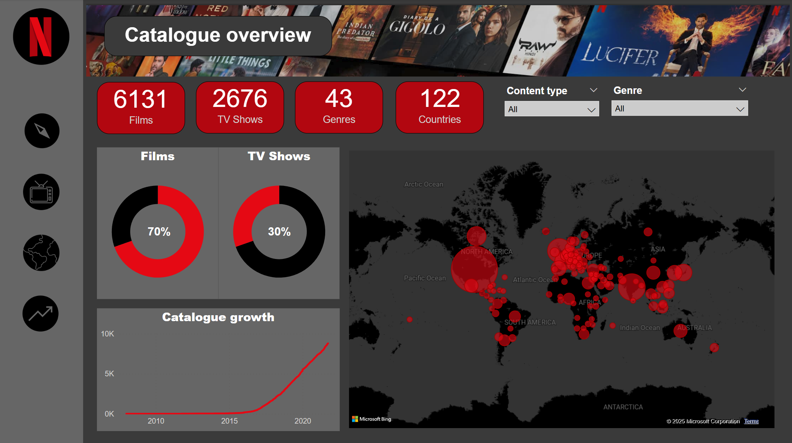
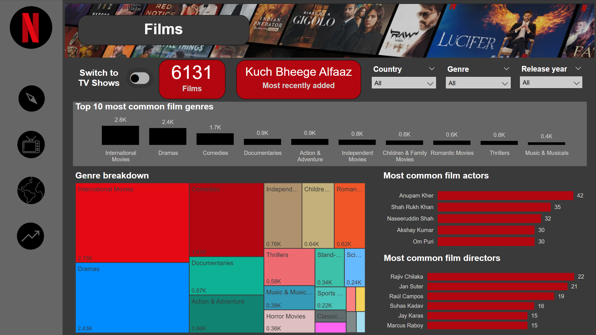
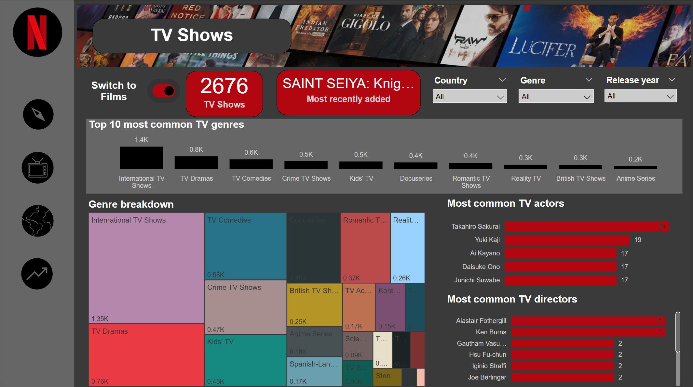
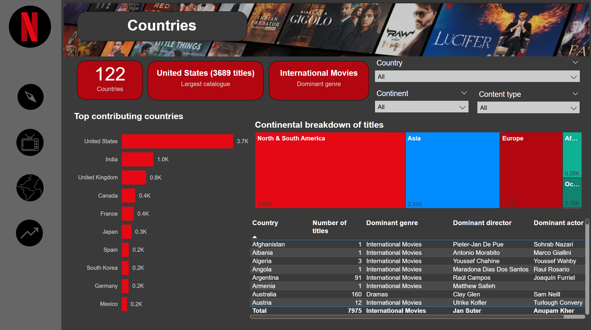
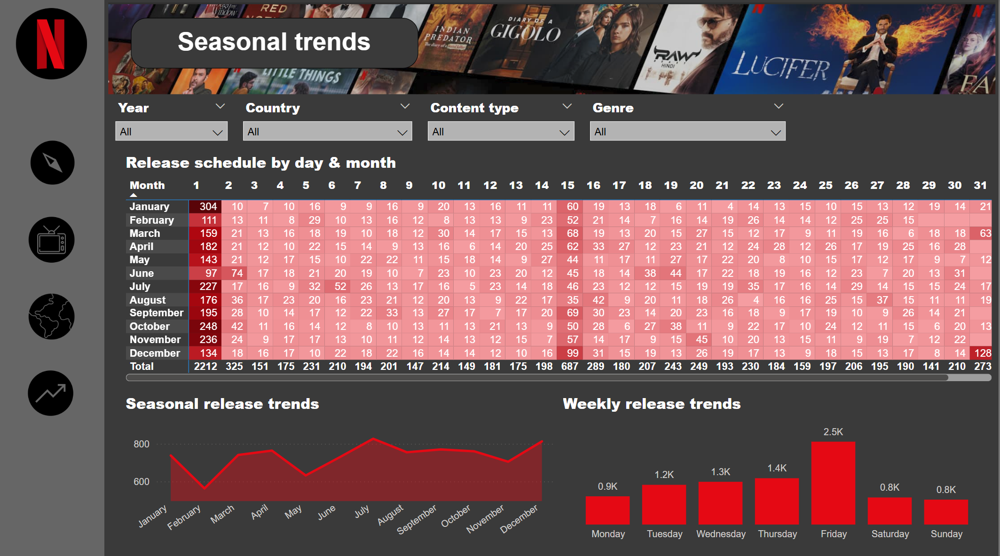

# 🍿 **Exploring Netflix's catalogue in Power BI**
A Power BI dashboard visualising insights into Netflix' streaming content catalogue by genre and geography.

---

## 📌 **Overview**

This project analyses Netflix’s content library using **Power BI** to uncover trends related to:  

- **Content distribution** (films vs. TV shows) 
- **Most common genres** 
- **Geographical availability** 
- **Seasonal trends in content releases** 

The dashboard provides interactive visualisations that help explore the size and composition of Netflix’s catalogue across **122 countries**, **43 genres**, and over **8,800 titles**.

---

## 📊 **Key features** 

The Power BI dashboard consists of **four main pages**:  

1. **Catalogue Overview** 📺  
   - Total number & proportion of **films** and **TV shows**
   - Number of **genres** & **countries** represented by the catalogue
   - **Distribution map** showing Netflix’s content spread worldwide & number of titles per country  
   - **Content growth trend** over time
   - Slicers allowing users to filter insights by **content type** (film/TV) and **genre**
  

2. **Films & TV Shows (Toggle View)** 🎬📺  
   - **Switchable view** between **Films** and **TV Shows** using an intuitive toggle button
   - Top **10 most common genres**  
   - Breakdown of genres using a **treemap**  
   - Most frequently appearing **actors** and **directors**
   - Cards showing **total number of films/TV series** (according to view selected) & **most recently added title**
   - Ability to filter by **country**, **genre** and **release year**
  

3. **Countries** 🌎  
   - Top 10 countries contributing the most Netflix content  
   - **Dominant genres per country**  
   - **Continental distribution** of content
   - A filterable **table** showing insights into the **number of titles contributed** and **dominant genre, director and actor** for each country
   - Filterable by **country**, **continent** and **content type**
  

4. **Seasonal Trends** 📆  
   - **Release patterns by month and day**  
   - **Annual and weekly release trends**, highlighting peak content drops
   - Filterable by **year**, **country**, **content type** and **genre** for more granular trends
  

  
---

## 📂 **Dataset**  

The dataset (Netflix Movies and TV Shows) was sourced from [Kaggle](https://www.kaggle.com/datasets/shivamb/netflix-shows) and contains metadata on Netflix’s catalogue, including:  

- `title`: The name of a piece of content.
- `type`: Whether a piece of content is a film or a TV show.
- `listed_in`: The **genre** of the film or TV Show.
- `director`: The director(s) of a piece of content.
- `cast`: The actors appearing in the title.
- `country`: The country (/countries) where a piece of content was produced.
- `release_year`: The year a piece of content was first released.
- `date_added`: The date a piece of content was added to the Netflix platform (not always the same as `release_year` if not an original Netflix production).

It contains a total of 12 columns and 8807 rows.

Data cleaning and transformation were performed in **Power Query**, ensuring consistency for analysis.

---

## ⚙️ **Data Processing**  

To ensure the dataset was clean, consistent, and optimised for analysis in **Power BI**, the following preprocessing steps were applied:

1. **Data Ingestion & Exploration**  
   - Imported the dataset into **Power BI** via **Power Query**.  
   - Conducted **Exploratory Data Analysis (EDA)** to understand missing values, inconsistencies, and key trends.

2. **Data Cleaning & Transformation**  
   - **Standardised column names** for consistency (e.g. changed `listed_in` to `genre`).  
   - **Converted data types** (e.g., ensuring dates were in `DateTime` format).  
   - **Handled missing values**:  
     - Removed entries with critical missing data (e.g., missing title, type).  
     - Filled or imputed missing values where feasible.  
   - **Standardised column values** for better readability (e.g. changed all mentions of "Movie" in `type` column to "Film" according to British English convention).
  
### **3. Data Normalisation: Creating New Tables**  
A number of columns contained multiple entries. This posed a problem for the accurate visualisation of certain fields (e.g. `genre`, `country`, `cast`, `director`). For these columns, a new dataset was created with just the columns `show_id` and the column in question, allowing for duplicate entries if a film or TV show had multiple genres, directors, cast members or countries of origin. This ensured for more accurate analysis and aggregation of these columns.

Additionally, the `film_duration` column contained a mix of different types of data (duration in minutes or duration in number of seasons) depending on the type of content for a given title. This meant that the column needed to be split in two according to content `type` to facilitate visualisation.

To ensure more accurate analysis and improve filtering, **data normalisation** was performed by breaking down the dataset into separate tables:

- **`countries`** – Extracted **country information** from the main dataset, enabling geographic analysis.  
- **`directors`** – Created a separate **directors table**, linking each film/TV show to its director(s).  
- **`cast_members`** – Extracted and normalised **cast members**, allowing for better actor-based insights.  
- **`genres`** – Normalised multi-genre listings, ensuring accurate genre-based filtering.  
- **`film_durations` & `tv_show_durations`** – Separated **film and TV show durations** for better runtime analysis.

The original columns were then dropped from the original `netflix_titles` fact table and relationships were then established between the new tables and the fact table in the Modelling View, using `show_id` as the key and ensuring proper cardinality.

At the end of this normalisation process the data model followed a star schema, **with `netflix_titles` as the central fact table** and the newly created tables (`countries`, `directors`, `cast_members`, `genres`, `film_durations`, and `tv_show_durations`) acting as **dimension tables**. This structure improved **data integrity, filtering efficiency, and aggregation accuracy** across the dashboard.

### **4. Feature Engineering**  
To enhance analysis and enable deeper insights, several **calculated columns and DAX measures** were created in **Power BI**:

#### **Custom Date Features** (for trend analysis)  
- **`Day_Name`** – Extracted day of the week from `date_added` to analyse daily release patterns.  
- **`Month_Name` & `Month_Sort_Order`** – Extracted month names and assigned sort order for proper chronological display.  
- **`Day_of_Week`** – Numeric representation of the weekday for sorting.  

#### **Content Distribution & Aggregation Measures**  
- **`_Daily_Releases`** – Count of titles released per day.  
- **`_Cumulative_Content`** – Running total of Netflix catalogue growth over time.  
- **`_Number_of_Titles_per_Country`** – Count of titles available per country.  

#### **Genre & Cast Analysis**  
- **`_Genre_Count`** – Number of times a genre appears across all titles.  
- **`_Dominant_Genre_Global`** – Identifies the most frequent genre in the dataset.  
- **`_Dominant_Actor` & `_Dominant_Director`** – Most frequently appearing actors and directors.  

#### **Recently Added Content Insights**  
- **`_Most_Recent_Date_Added`** – Latest content addition date in the dataset.  
- **`_Most_Recently_Added_Title`** – Last title added to Netflix.  
- **`_Most_Recently_Added_Director`** – Director of the latest added content.  
- **`_Most_Recently_Added_Description`** – Description of the most recent addition.  

#### **Content Type Percentage Measures**  
- **`_Percentage_Films` & `_Percentage_TV_Shows`** – Proportion of films vs. TV shows in the dataset.  
- **`_Percentage_Movies`** – Alternative measure for film percentage.  
- **`_Percentage_Films_No_Blank` & `_Percentage_TV_Shows_No_Blank`** – Filters out blank values for more accurate percentages.  

These **DAX measures** and **calculated columns** were essential for creating interactive **visualisations**, enabling dynamic filtering, ranking, and time-based analysis in **Power BI**.

These transformations ensured the dataset was **clean, structured, and optimised** for interactive visualisation in **Power BI**.

---

## 🚀 **Technologies used**  

- **Power BI** – For data visualisation  
- **Power Query** – Data transformation and cleaning  
- **DAX (Data Analysis Expressions)** – Custom calculations and measures  

---

## 📥 **How to use the dashboard**  
1. Install [Power BI Desktop](https://www.microsoft.com/fr-fr/power-platform/products/power-bi/desktop?msockid=38178c20f62d614234979884f7946082)
2. **Download the Power BI (.pbix) file** from this repository 
2. Open the file in **Power BI Desktop**  
3. Interact with the filters to explore different insights  

---

## 📌 **Future improvements**  
- **Deeper genre-specific analysis** (e.g., which genres dominate in certain regions)
- **More granular analysis of release trends** (e.g. hourly hotspots / see which genres or type of content tend to be uploaded at particular times of year)
- **Integration with IMDb or Rotten Tomatoes ratings** to assess content quality
- **Tracking Netflix Originals separately**

---

## 📧 **Contact**  
For questions or feedback, feel free to connect with me on [LinkedIn](https://www.linkedin.com/in/nedchambers/).  
